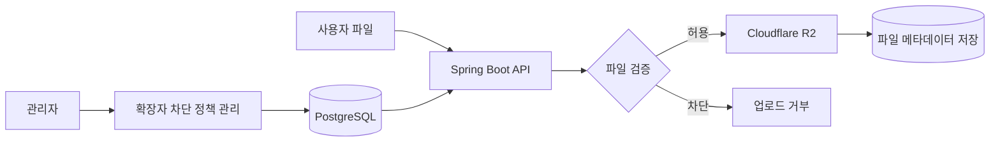
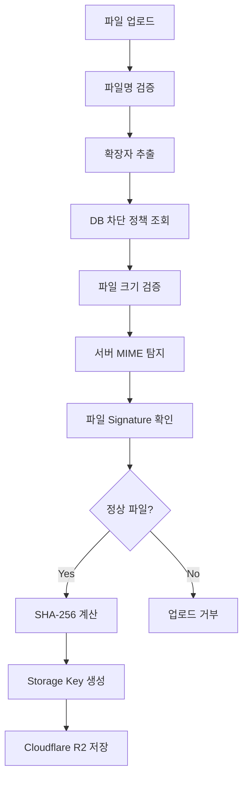
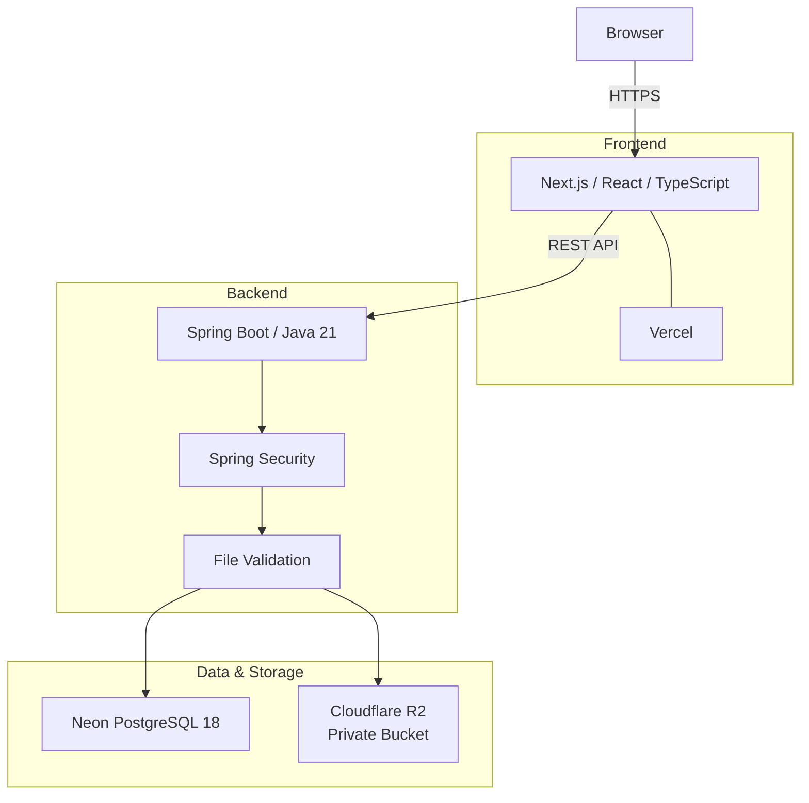
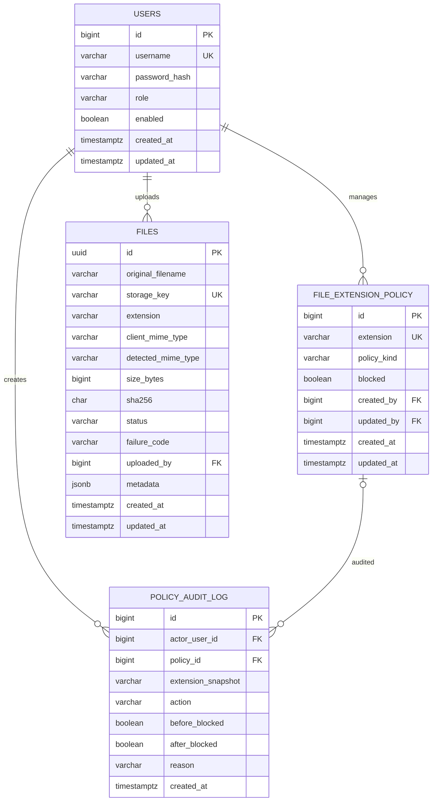
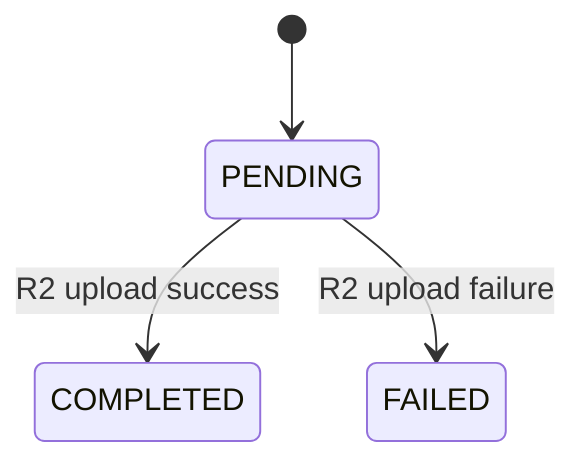

# 🔐 Safe File Upload Policy Manager

확장자 차단 정책을 관리하고, 업로드되는 파일을 서버에서 검증한 뒤 안전하게 저장하는 **파일 업로드 관리 서비스**입니다.

관리자는 자주 차단하는 고정 확장자와 커스텀 확장자를 관리할 수 있으며,  
사용자가 파일을 업로드하면 서버가 현재 저장된 정책과 파일 정보를 확인하여 업로드 허용 여부를 결정합니다.

---

# 서비스 소개

이 서비스는 파일 업로드가 필요한 시스템에서 **업로드 가능한 파일의 확장자 정책을 관리하고 실제 업로드 단계에서 해당 정책을 적용**하기 위한 관리자용 웹 애플리케이션입니다.



파일은 단순히 이름만 확인하지 않고 서버에서 여러 단계를 거쳐 검증됩니다.

```text
파일 선택
   ↓
파일명 / 확장자 확인
   ↓
DB 차단 정책 확인
   ↓
파일 크기 확인
   ↓
MIME / 파일 형식 확인
   ↓
정상 파일만 Object Storage에 저장
```

---

# 주요 기능

## 1. 고정 확장자 관리

자주 차단하는 실행 파일 및 스크립트 확장자를 기본 정책으로 제공합니다.

```text
bat
cmd
com
cpl
exe
scr
js
```

각 확장자는 체크박스로 차단 여부를 변경할 수 있습니다.

- 기본값은 차단 해제
- 체크/해제 즉시 DB 저장
- 새로고침 후에도 상태 유지
- 업로드 시 현재 정책을 서버에서 적용

---

## 2. 커스텀 확장자 관리

관리자가 직접 차단할 확장자를 추가할 수 있습니다.

### 지원 기능

- 최대 20자
- 최대 200개 등록
- 중복 등록 방지
- 대소문자 정규화
- 등록 / 삭제
- 등록 사유 저장
- 목록 pagination
- 확장자 오름차순 정렬

입력값은 다음과 같이 정규화됩니다.

```text
trim
→ 앞쪽 "." 제거
→ lowercase
→ 형식 검사
→ 중복 검사
```

예:

```text
.PDF  → pdf
 Pdf  → pdf
```

커스텀 확장자는 다음 형식을 사용합니다.

```regex
^[a-z0-9]{1,20}$
```

---

## 3. 실제 파일 업로드

등록된 확장자 정책은 실제 파일 업로드에 적용됩니다.

업로드 요청은 파일별로 독립적으로 처리됩니다.

```text
file A ── POST /api/files ──►
file B ── POST /api/files ──► Spring Boot
file C ── POST /api/files ──►
```

### 업로드 제한

```text
파일 1개       100 MiB 미만
한 번에 선택   최대 10개
선택 총 용량   최대 500 MiB
동시 업로드     최대 3개
```

---

## 4. 파일 검증

Backend가 업로드 파일을 직접 검증합니다.



검증 항목:

- 파일명
- 확장자
- 차단 정책
- 파일 크기
- MIME Type
- 파일 Signature / Magic Number
- 확장자와 실제 파일 형식의 일치 여부

Apache Tika를 사용해 서버에서 파일 형식을 확인합니다.

---

## 5. 파일명 처리

일반적인 문서 파일명을 사용할 수 있도록 다음 문자를 허용합니다.

```text
한글
영문
숫자
공백
-
_
.
```

예:

```text
분석 보고서.pdf
2026_보안-검토.pdf
my report_v2.pdf
```

다음 형태의 파일명은 허용하지 않습니다.

```text
.env
README
report.exe.txt
../report.txt
-leading.txt
```

주요 제한:

- 확장자 없는 파일 차단
- 점(`.`)으로 시작하는 파일 차단
- `/`, `\` 포함 파일명 차단
- `..` 차단
- 제어문자 차단
- 일반적인 이중 확장자 차단
- 파일명 최대 255자

정상적인 압축 파일 형식은 예외적으로 지원합니다.

```text
.tar.gz
.tar.bz2
.tar.xz
.tar.zst
```

---

## 6. 업로드 진행 상태

여러 파일을 선택하면 각 파일의 업로드 상태와 진행률을 확인할 수 있습니다.

지원 상태:

```text
READY
UPLOADING
RETRYING
SUCCESS
REJECTED
FAILED
```

파일별로:

- 업로드 진행률
- 업로드 성공 여부
- 정책에 의한 거부
- 서버 오류
- 재시도 상태

를 확인할 수 있습니다.

---

## 7. 관리자 로그인

관리 기능은 로그인 후 사용할 수 있습니다.

인증 방식:

```text
Spring Security
Session Authentication
CSRF Protection
BCrypt Password Hash
```

DB에는 비밀번호 원문 대신 BCrypt Hash를 저장합니다.

---

## 8. 정책 변경 이력

확장자 정책을 변경하면 Audit Log가 저장됩니다.

기록 항목:

```text
변경한 관리자
확장자
변경 종류
변경 전 상태
변경 후 상태
변경 사유
변경 시간
```

지원 Action:

```text
FIXED_BLOCK
FIXED_UNBLOCK
CUSTOM_ADD
CUSTOM_DELETE
```

---

# Architecture



### 데이터 저장 방식

```text
PostgreSQL
├─ 사용자
├─ 확장자 정책
├─ 정책 변경 이력
└─ 파일 메타데이터

Cloudflare R2
└─ 실제 파일 Binary
```

파일 binary를 DB에 저장하지 않고 Object Storage와 분리했습니다.

---

# Tech Stack

## Frontend


- Next.js 16.3.2
- React 19
- TypeScript
- Tailwind CSS
- XMLHttpRequest
- Vercel

`XMLHttpRequest.upload.onprogress`를 사용해 파일별 업로드 진행률을 표시합니다.

---

## Backend


- Java 21
- Spring Boot 4.1.1
- Spring MVC
- Spring Security
- Spring Data JPA
- Hibernate
- Flyway
- Apache Tika
- AWS SDK for Java 2.x
- HikariCP
- Maven
- Docker
- Render

---

## Database / Storage

- PostgreSQL 18
- Neon
- Cloudflare R2
- AWS S3-compatible API

---

# Project Structure

```text
file-upload-assignment/
├─ file-upload-backend/
│  ├─ Dockerfile
│  ├─ pom.xml
│  ├─ mvnw
│  └─ src/
│     └─ main/
│        ├─ java/com/fileupload/
│        │  ├─ auth/
│        │  ├─ common/
│        │  ├─ file/
│        │  ├─ policy/
│        │  └─ user/
│        │
│        └─ resources/
│           ├─ application.yml
│           └─ db/migration/
│              ├─ V1__create_initial_schema.sql
│              └─ V2__seed_initial_data.sql
│
└─ file-upload-frontend/
   ├─ app/
   ├─ components/
   ├─ lib/
   ├─ public/
   └─ package.json
```

---

# Database Schema

## `file_extension_policy`

확장자 정책을 저장하는 핵심 테이블입니다.

| Column | Type | Null | Description |
|---|---|---:|---|
| `id` | `BIGINT IDENTITY` | NO | Primary Key |
| `extension` | `VARCHAR(20)` | NO | 정규화된 확장자 |
| `policy_kind` | `VARCHAR(10)` | NO | `FIXED` / `CUSTOM` |
| `blocked` | `BOOLEAN` | NO | 차단 여부 |
| `created_by` | `BIGINT` | YES | 생성한 관리자 |
| `updated_by` | `BIGINT` | YES | 마지막 수정 관리자 |
| `created_at` | `TIMESTAMPTZ(3)` | NO | 생성 시각 |
| `updated_at` | `TIMESTAMPTZ(3)` | NO | 수정 시각 |

### Constraints

```text
PRIMARY KEY
  id

UNIQUE
  extension

CHECK
  extension ~ '^[a-z0-9]{1,20}$'

CHECK
  policy_kind IN ('FIXED', 'CUSTOM')
```

고정 확장자는 다음 값만 허용됩니다.

```text
bat
cmd
com
cpl
exe
scr
js
```

커스텀 확장자는 최대 200개까지 저장할 수 있으며, DB Trigger에서도 개수 제한을 검사합니다.

---

## 전체 테이블



---

# File Storage

업로드된 파일은 Cloudflare R2의 Private Bucket에 저장됩니다.

사용자가 업로드한 원본 파일명을 Object Key로 직접 사용하지 않습니다.

Object Key 형식:

```text
uploads/yyyy/MM/{uuid}
```

예:

```text
uploads/2026/08/890c4c3d-bee7-42c6-97ef-2e3171399216
```

PostgreSQL에는 원본 파일명과 Storage Key를 별도로 저장합니다.

```text
original_filename
storage_key
```

---

# Upload State

파일 업로드 상태는 DB에서 다음과 같이 관리합니다.



```text
PENDING
COMPLETED
FAILED
```

---

# Installation

## Requirements

Backend:

```text
Java 21
```

Frontend:

```text
Node.js 20+
npm
```

Database:

```text
PostgreSQL 18
```

File Storage:

```text
Cloudflare R2 bucket
```

---

# Backend Setup

## 1. Environment Variables

다음 환경변수가 필요합니다.

```properties
DB_URL=jdbc:postgresql://HOST/DATABASE?sslmode=require
DB_USERNAME=...
DB_PASSWORD=...

FRONTEND_ORIGIN=http://localhost:3000

R2_ENDPOINT=https://ACCOUNT_ID.r2.cloudflarestorage.com
R2_BUCKET=...
R2_REGION=auto
R2_ACCESS_KEY_ID=...
R2_SECRET_ACCESS_KEY=...
```

실제 credential은 Git Repository에 저장하지 않습니다.

---

## 2. Run Backend

Linux / macOS / Git Bash:

```bash
cd file-upload-backend
./mvnw spring-boot:run
```

Windows PowerShell:

```powershell
cd file-upload-backend
.\mvnw.cmd spring-boot:run
```

기본 포트:

```text
http://localhost:8080
```

Flyway가 애플리케이션 실행 시 DB Schema를 자동으로 적용합니다.

---

# Frontend Setup

## 1. Install

```bash
cd file-upload-frontend
npm install
```

---

## 2. Environment Variable

`.env.local`

```properties
NEXT_PUBLIC_API_BASE_URL=http://localhost:8080
```

---

## 3. Run

```bash
npm run dev
```

기본 주소:

```text
http://localhost:3000
```

---

## Build

```bash
npm run lint
npm run build
```

---

# Environment Variables

| Variable | Application | Description |
|---|---|---|
| `DB_URL` | Backend | PostgreSQL JDBC URL |
| `DB_USERNAME` | Backend | DB Username |
| `DB_PASSWORD` | Backend | DB Password |
| `FRONTEND_ORIGIN` | Backend | 허용할 Frontend Origin |
| `R2_ENDPOINT` | Backend | Cloudflare R2 S3 Endpoint |
| `R2_BUCKET` | Backend | R2 Bucket Name |
| `R2_REGION` | Backend | R2 Region (`auto`) |
| `R2_ACCESS_KEY_ID` | Backend | R2 Access Key |
| `R2_SECRET_ACCESS_KEY` | Backend | R2 Secret Key |
| `NEXT_PUBLIC_API_BASE_URL` | Frontend | Backend API URL |

---

# API Overview

## Authentication

```http
GET  /api/auth/csrf
POST /api/auth/login
GET  /api/auth/me
POST /api/auth/logout
```

## Fixed Extension Policy

```http
GET   /api/extension-policies/fixed
PATCH /api/extension-policies/{id}/blocked
```

## Custom Extension Policy

```http
GET    /api/extension-policies/custom
POST   /api/extension-policies/custom
DELETE /api/extension-policies/custom/{id}
```

## File Upload

```http
POST /api/files
Content-Type: multipart/form-data
```

한 요청에는 파일 하나를 전송합니다.

---

# Deployment

현재 프로젝트는 다음 환경에 배포되어 있습니다.

```text
Frontend
Vercel
   │
   ▼
Backend
Render
   │
   ├────► Neon PostgreSQL
   │
   └────► Cloudflare R2
```

| Component | Provider |
|---|---|
| Frontend | Vercel |
| Backend | Render |
| Database | Neon |
| File Storage | Cloudflare R2 |

---

# Current Scope

현재 제공하는 기능:

```text
관리자 로그인
확장자 정책 관리
정책 변경 Audit
실제 파일 업로드
파일 검증
R2 저장
업로드 진행률 / 상태 표시
```

현재 포함하지 않는 기능:

```text
업로드 파일 목록
파일 다운로드
업로드된 파일 삭제
회원가입
사용자별 파일 권한
사용자별 확장자 정책
```

---

# Summary

```text
관리자가 차단 확장자를 설정
          ↓
      PostgreSQL 저장
          ↓
     사용자가 파일 업로드
          ↓
 Spring Boot에서 파일 검증
          ↓
 정상 파일만 Cloudflare R2 저장
```

**Safe File Upload Policy Manager**는 확장자 정책 관리와 실제 파일 업로드 처리를 하나의 흐름으로 연결한 파일 업로드 관리 서비스입니다.
